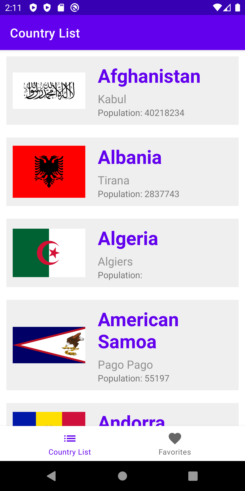
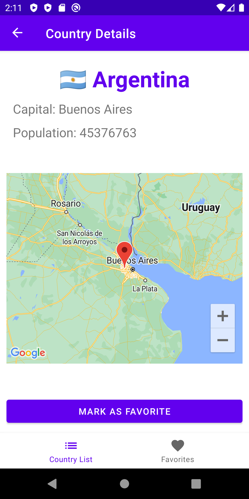
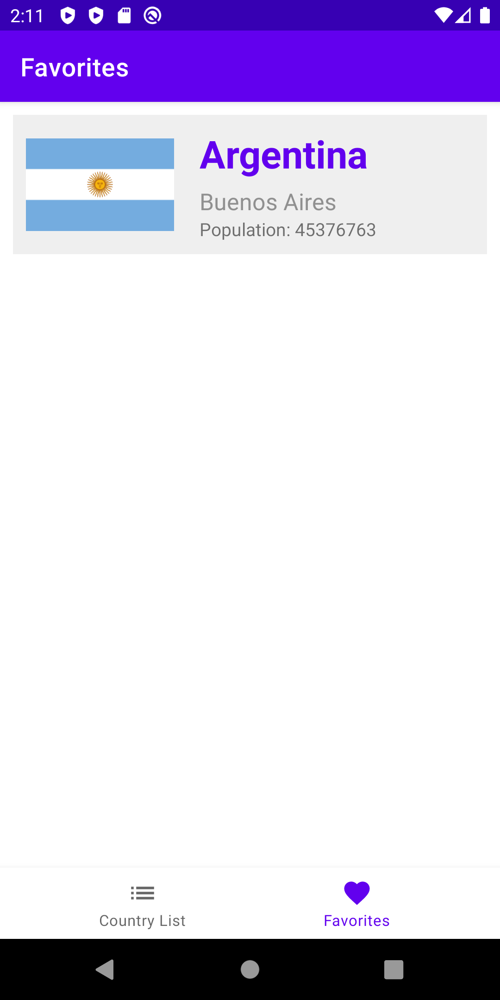

# World Countries Information

An Android application that displays information about world countries

Project Features:
- Country data is retrieved from API: https://restcountries.com/v3.1/all
- Implement Google Map to display country location
- Users' favourite list is saved in a local database using Room

### 3 screens inside this application 
| 1. List of World Countries Screen | 2. Country Details Screen | 3. Favourite Country List Screen |
| ----------- | ---------- | ---------- | 
|  |  |  |

